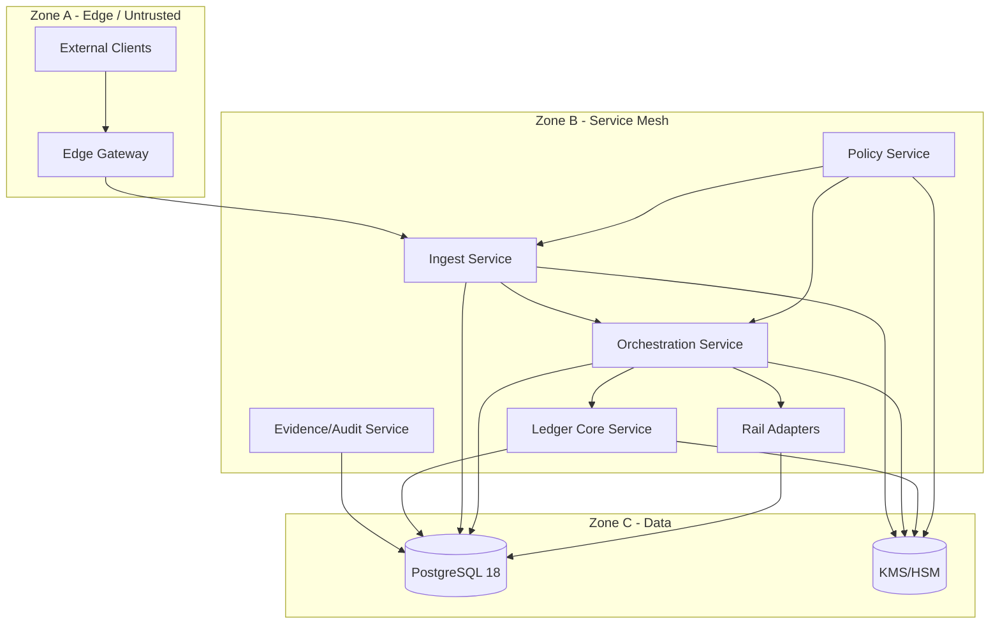
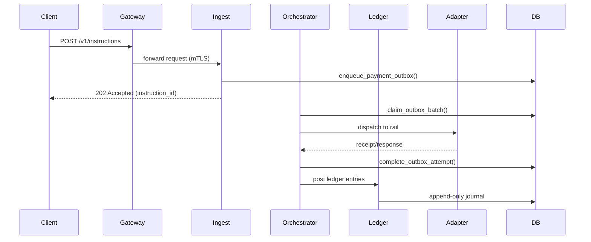
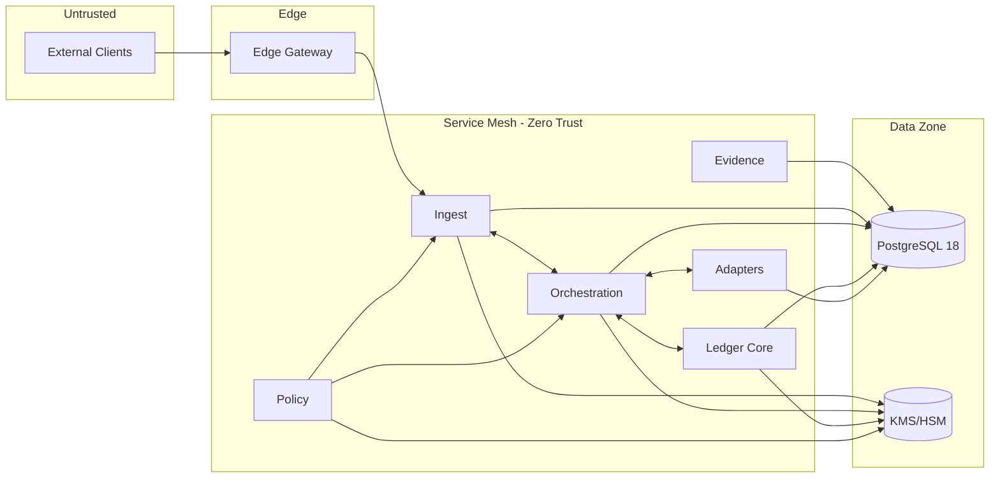
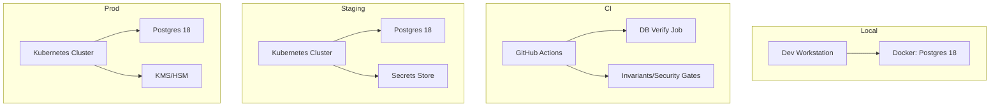

# Architecture Diagrams

## High-level system component diagram

```mermaid
flowchart TB
  subgraph ZoneA[Zone A - Edge / Untrusted]
    Client[External Clients]
    Gateway[Edge Gateway]
  end

  subgraph ZoneB[Zone B - Service Mesh]
    Ingest[Ingest Service]
    Orchestrator[Orchestration Service]
    Ledger[Ledger Core Service]
    Policy[Policy Service]
    Evidence[Evidence/Audit Service]
    Adapter[Rail Adapters]
  end

  subgraph ZoneC[Zone C - Data]
    DB[(PostgreSQL 18)]
    KMS[(KMS/HSM)]
  end

  Client --> Gateway --> Ingest
  Ingest --> Orchestrator
  Orchestrator --> Ledger
  Orchestrator --> Adapter
  Policy --> Ingest
  Policy --> Orchestrator
  Evidence --> DB
  Ledger --> DB
  Ingest --> DB
  Orchestrator --> DB
  Adapter --> DB
  Ingest --> KMS
  Orchestrator --> KMS
  Ledger --> KMS
  Policy --> KMS
```

## Data flow diagram (key payment flow)

```mermaid
sequenceDiagram
  participant C as Client
  participant G as Gateway
  participant I as Ingest
  participant O as Orchestrator
  participant L as Ledger
  participant A as Adapter
  participant D as DB

  C->>G: POST /v1/instructions
  G->>I: forward request (mTLS)
  I->>D: enqueue_payment_outbox()
  I-->>C: 202 Accepted (instruction_id)
  O->>D: claim_outbox_batch()
  O->>A: dispatch to rail
  A-->>O: receipt/response
  O->>D: complete_outbox_attempt()
  O->>L: post ledger entries
  L->>D: append-only journal
```

## Trust boundary diagram

```mermaid
flowchart LR
  subgraph Untrusted
    Client[External Clients]
  end
  subgraph Edge
    Gateway[Edge Gateway]
  end
  subgraph ServiceMesh[Service Mesh - Zero Trust]
    Ingest[Ingest]
    Orchestrator[Orchestration]
    Ledger[Ledger Core]
    Policy[Policy]
    Evidence[Evidence]
    Adapter[Adapters]
  end
  subgraph DataZone[Data Zone]
    DB[(PostgreSQL 18)]
    KMS[(KMS/HSM)]
  end

  Client --> Gateway --> Ingest
  Ingest <--> Orchestrator
  Orchestrator <--> Ledger
  Orchestrator <--> Adapter
  Policy --> Ingest
  Policy --> Orchestrator
  Evidence --> DB
  Ingest --> DB
  Orchestrator --> DB
  Ledger --> DB
  Adapter --> DB
  Ingest --> KMS
  Orchestrator --> KMS
  Ledger --> KMS
  Policy --> KMS
```

## Deployment diagram (local, CI, staging, prod)

```mermaid
flowchart TB
  subgraph Local
    L1[Dev Workstation]
    L2[Docker: Postgres 18]
    L1 --> L2
  end
  subgraph CI
    C1[GitHub Actions]
    C2[DB Verify Job]
    C3[Invariants/Security Gates]
    C1 --> C2
    C1 --> C3
  end
  subgraph Staging
    S1[Kubernetes Cluster]
    S2[Postgres 18]
    S3[Secrets Store]
    S1 --> S2
    S1 --> S3
  end
  subgraph Prod
    P1[Kubernetes Cluster]
    P2[Postgres 18]
    P3[KMS/HSM]
    P1 --> P2
    P1 --> P3
  end
```
