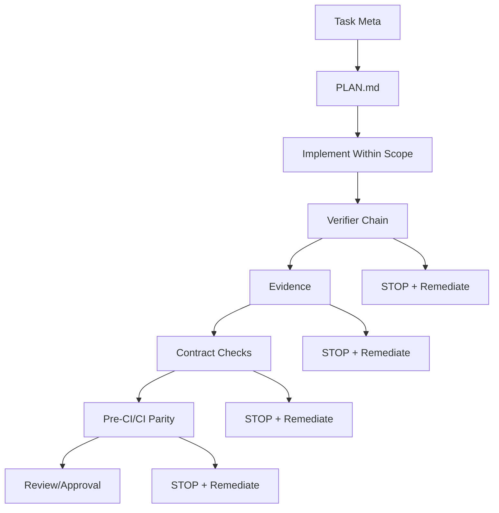

# Agentic SDLC Implementation Playbook for Symphony (Supporting Runbook)

Date: 2026-02-16
Owner: Architecture / Platform
Policy authority: `docs/operations/AGENTIC_SDLC_PHASE1_POLICY.md`

## 1) Role of This Document
This file is an implementation runbook.

It does not define policy. If any section conflicts with canonical policy, the canonical policy wins.

## 2) Implementation Focus
Use this runbook to execute the policy with minimal scope and maximum determinism.

Primary objective:
- one repeatable factory-line workflow
- no scope creep
- no gate weakening

## 3) Factory-Line Workflow

## 4) Immediate Rollout Plan

### Phase A (Now): stabilize core loop
1. Use two execution roles: Architect Agent + Implementer Agent.
2. Enable one advisory-only MCP role: Requirements & Policy Integrity Agent (no execution authority).
3. Enforce canonical gate chain from policy.
4. Forbid additional role proliferation and optional orchestration layers.

### Phase B (After two clean pilot tasks)
1. Evaluate if additional role separation is needed.
2. Add optional tooling only after proving no nondeterminism or leakage.

## 5) Mechanical Execution Checklist
Execute this sequence for each Phase-1 task:
1. Confirm task meta declares invariants/verifiers/evidence.
2. Ensure `PLAN.md` and `EXEC_LOG.md` exist and are linked.
3. Implement only scoped files.
4. Run required verifier chain.
5. Validate required evidence paths and schemas.
6. Run parity checks.
7. Submit for approval.
8. If artifact paths/contracts changed, enforce one-shot cutover:
- no dual-write behavior
- no legacy fallback reads
- no retained legacy references in tasks/plans/contracts/verifiers

## 6) Diff Semantics Rollout (Concrete)
Current canonical diff tooling already exists:
- `scripts/lib/git_diff.sh`
- `scripts/audit/git_diff_cli.sh`

Status:
- Range-only parity intent is already implemented in Phase-0 (`TSK-P0-152`, `TSK-P0-154`, `TSK-P0-155`).
- Follow-on hardening to enforce strict range-only parity-critical usage is tracked in `TSK-P1-027`.

Migration priority for drift-prone checks:
1. Structural detection flows.
2. Contract/evidence checks that depend on changed-file logic.
3. Any local-vs-CI differing gate scripts.

Each migrated script must log:
- diff mode
- base/head refs
- resolved merge base (for range mode)

## 7) External Source Usage (Operational)
When `external_sources_used=true` in task meta:
1. Add `sources:` block in `PLAN.md` per policy schema.
2. Record retrieved timestamps.
3. Link source purpose to explicit task scope.
4. Treat missing source metadata as policy failure.

## 8) What Not to Do
1. Do not add “to be introduced” artifact paths in execution docs without binding via task + invariant + gate + verifier.
2. Do not declare new product surfaces in Phase-1 unless explicitly approved and fully controlled.
3. Do not create parallel policy documents.

## 9) Runbook Definition of Success
A run is successful only when:
1. All required commands pass.
2. No required evidence is missing.
3. No diff-semantics mismatch appears between local and CI.
4. No policy exceptions are silently introduced.
