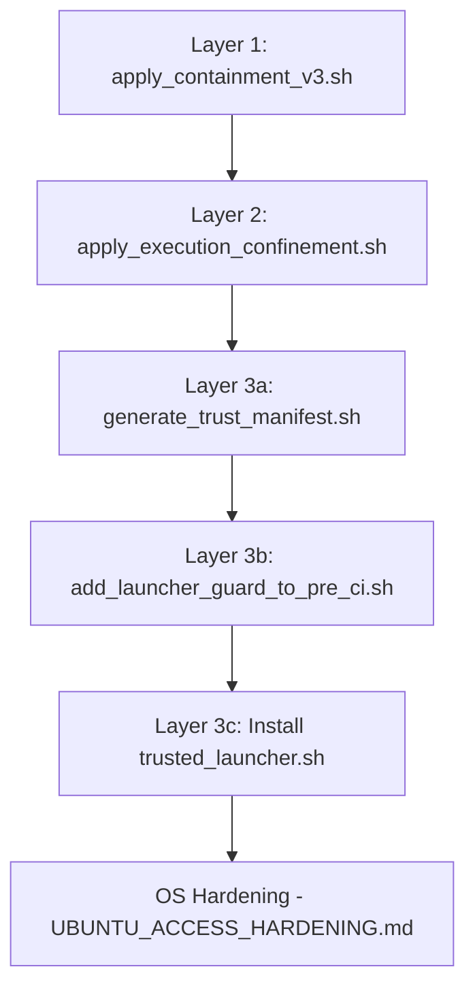

# Execution Confinement v2 — Implementation Plan

**Phase Key:** CONF  
**Phase Name:** Execution Confinement  
**Mode Classification:** IMPLEMENT-TASK (per AGENT_PROMPT_ROUTER.md — applying staged, human-authored enforcement scripts)  
**Canonical Reference:** `docs/operations/AI_AGENT_OPERATION_MANUAL.md`  
**Owner Role:** Security Guardian Agent (paths: `scripts/audit/**`, `scripts/dev/pre_ci.sh`)

---

## Background

This plan applies the 9 scripts in `_staging/symphony-enforcement-v2/execution-confinement/` to the live repository. These scripts exist because:

1. **Agents fabricate evidence** by writing `{"status":"PASS"}` directly into JSON files  
2. **Agents game grep-based verifiers** by placing target strings in comments  
3. **Agents set bypass env vars** like `SKIP_CI_DB_PARITY_PROBE=1`  
4. **Agents execute verifiers directly** outside the pre_ci.sh harness, bypassing all enforcement gates  

The enforcement package closes these attack vectors across three layers.

> [!IMPORTANT]
> These scripts were authored by a human and staged for application. This plan applies them — it does NOT re-implement or modify the enforcement logic. Any modifications require human approval.

---

## User Review Required

> [!WARNING]
> **Anchor Dependencies:** Three of the apply scripts locate insertion points in `pre_ci.sh` using anchor strings (e.g., `pre_ci_check_drd_lockout`, `Pre-CI local checks PASSED`, `GF verifier execution posture lint`). If `pre_ci.sh` has been modified since the staging scripts were written, these anchors may not resolve. I will validate all anchors before patching — but if any are missing, I will STOP and report.

> [!CAUTION]
> **Trusted Launcher blocks direct pre_ci.sh invocation.** After `add_launcher_guard_to_pre_ci.sh` is applied, `bash scripts/dev/pre_ci.sh` from any agent (or human terminal) will fail with `FATAL: pre_ci.sh must be executed via trusted_launcher.sh`. This requires establishing the trust keypair FIRST and installing the launcher. Do you want the launcher guard applied in this pass, or deferred to a separate human-only session?

> [!IMPORTANT]
> **UBUNTU_ACCESS_HARDENING.md is human-executed.** Steps 2-8 of that document require `sudo` and filesystem ownership changes. The agent cannot and should not perform those. This plan records the document but does not execute it.

---

## Staging Inventory (9 Files)

| # | File | Purpose | Apply Target |
|---|------|---------|-------------|
| 1 | `strip_bypass_env_vars.sh` | Detect+log+strip bypass env vars | → `scripts/audit/` |
| 2 | `sign_evidence.py` | HMAC-sign evidence with per-run key | → `scripts/audit/` |
| 3 | `lint_verifier_ast.py` | Structural psql command detection | → `scripts/audit/` |
| 4 | `apply_containment_v3.sh` | Installs 1-3 + patches pre_ci.sh | Runner script |
| 5 | `apply_execution_confinement.sh` | PRE_CI_CONTEXT guards + integrity manifest | Runner script |
| 6 | `generate_trust_manifest.sh` | Signs integrity manifest with private key | Requires keypair |
| 7 | `trusted_launcher.sh` | Root of trust — snapshot+verify+execute | → `/usr/local/bin/symphony_ci` |
| 8 | `add_launcher_guard_to_pre_ci.sh` | Blocks direct pre_ci.sh invocation | Patches pre_ci.sh |
| 9 | `UBUNTU_ACCESS_HARDENING.md` | OS-level filesystem protection | Human-only doc |

---

## Execution Order (Strict — Dependencies Are Sequential)

The scripts have a strict dependency chain. Running them out of order will fail.



---

## Proposed Changes

### Layer 1 — Containment v3 (apply_containment_v3.sh)

**What it does:**
1. Copies `strip_bypass_env_vars.sh` → `scripts/audit/` (with sha256 verification)
2. Copies `sign_evidence.py` → `scripts/audit/` (with sha256 verification)
3. Copies `lint_verifier_ast.py` → `scripts/audit/` (with sha256 verification)
4. Patches `pre_ci.sh`:
   - **4a:** Sources `strip_bypass_env_vars.sh` after DRD lockout (anchor: `pre_ci_check_drd_lockout`)
   - **4b:** Adds AST lint gate after bash posture lint (anchor: `GF verifier execution posture lint`)
   - **4c:** Adds evidence signature verification before GF verifiers (anchor: `Green Finance Schema + Function Verification`)

**Preconditions to validate:**
- [ ] Anchor `pre_ci_check_drd_lockout` exists in pre_ci.sh
- [ ] Anchor `GF verifier execution posture lint` exists in pre_ci.sh
- [ ] Anchor `Green Finance Schema + Function Verification` exists in pre_ci.sh
- [ ] `/usr/bin/python3` exists and is executable

---

### Layer 2 — Execution Confinement (apply_execution_confinement.sh)

**What it does:**
1. Inserts `PRE_CI_CONTEXT` guard into 18 verifier scripts (blocks direct execution)
2. Patches pre_ci.sh: exports `PRE_CI_CONTEXT=1` and `PRE_CI_RUN_ID` (anchor: `pre_ci_check_drd_lockout`)
3. Builds integrity manifest at `.toolchain/script_integrity/verifier_hashes.sha256`
4. Inserts integrity verification block into pre_ci.sh (anchor: `end PRE_CI_CONTEXT_EXPORT`)

**Preconditions to validate:**
- [ ] All 18 GUARDED_SCRIPTS exist at their expected paths
- [ ] Step 2 anchor resolves (after Layer 1 patching)
- [ ] Step 4 anchor resolves (created by Step 2)

**Guarded scripts (18):**
- `scripts/db/verify_gf_sch_001.sh`, `verify_gf_sch_002a.sh`, `verify_gf_sch_008.sh`
- `scripts/db/verify_gf_fnc_001.sh` through `verify_gf_fnc_006.sh`
- `scripts/db/verify_gf_w1_fnc_001.sh` through `verify_gf_w1_fnc_004.sh`
- `scripts/audit/verify_agent_conformance.sh`, `verify_remediation_trace.sh`, `verify_remediation_artifact_freshness.sh`, `verify_task_meta_schema.sh`, `verify_task_plans_present.sh`

> [!NOTE]
> **Missing scripts → fail-closed.** The original version silently skipped missing scripts (WARN). The fixed version exits 1. If any of the 18 scripts don't exist, the apply step STOPS.

---

### Layer 3 — Trusted Launcher (Human-Coordinated)

> [!WARNING]
> Layer 3 requires human involvement: keypair generation, private key handling, `chattr +i`, and `sudo`. The agent orchestrates the preparatory steps but STOPS before any privileged operation.

#### 3a. generate_trust_manifest.sh
- Requires `TRUST_PRIVATE_KEY` env var pointing to the private key
- Keypair must be generated first: `openssl genrsa -out trust_private.pem 4096`
- Public key at `.toolchain/trust_pubkey.pem`

#### 3b. add_launcher_guard_to_pre_ci.sh
- Inserts launch token verification at top of pre_ci.sh
- Inserts post-execution integrity re-check at bottom
- After this, `bash scripts/dev/pre_ci.sh` directly is BLOCKED

#### 3c. trusted_launcher.sh installation
- Must be installed by human: `sudo cp ... /usr/local/bin/symphony_ci && sudo chattr +i`
- `EXPECTED_PUBKEY_HASH` must be set in the script before installation

#### 3d. UBUNTU_ACCESS_HARDENING.md
- OS filesystem hardening — entirely human-executed
- Creates `ci_harness_owner` user, transfers ownership of `scripts/audit/` and `scripts/dev/`

---

## Open Questions

> [!IMPORTANT]
> **Q1: Layer 3 in this pass?** The trusted launcher and its guard block direct `pre_ci.sh` execution. Should Layer 3 be applied now or deferred to a separate human-only session?

> [!IMPORTANT]
> **Q2: Missing guarded scripts?** `apply_execution_confinement.sh` references `scripts/db/verify_gf_sch_002a.sh`. Does this file exist? If any of the 18 listed scripts are missing, the apply step will fail-closed. Should I pre-validate and report, or should missing scripts be created as stubs first?

> [!IMPORTANT]
> **Q3: Wave 6 verifiers (007A, 007B, 005)?** The staging scripts were authored before Wave 6. New verifiers (`verify_gf_fnc_007a.sh`, `verify_gf_fnc_007b.sh`) are not in the GUARDED_SCRIPTS list. After applying, should I add them to the guard list and regenerate the manifest?

---

## Verification Plan

### Pre-Apply Validation (Non-Mutating)
```bash
# Check all anchors exist
grep -c "pre_ci_check_drd_lockout" scripts/dev/pre_ci.sh
grep -c "GF verifier execution posture lint" scripts/dev/pre_ci.sh
grep -c "Green Finance Schema + Function Verification" scripts/dev/pre_ci.sh
grep -c "Pre-CI local checks PASSED" scripts/dev/pre_ci.sh

# Check all 18 guarded scripts exist
for s in scripts/db/verify_gf_sch_001.sh scripts/db/verify_gf_sch_002a.sh ... ; do
  test -f "$s" && echo "OK: $s" || echo "MISSING: $s"
done

# Check python3
test -x /usr/bin/python3 && echo "OK" || echo "MISSING"
```

### Post-Apply Verification

| Check | Command | Expected |
|-------|---------|----------|
| Layer 1 tools installed | `test -f scripts/audit/strip_bypass_env_vars.sh && test -f scripts/audit/sign_evidence.py && test -f scripts/audit/lint_verifier_ast.py` | All exist |
| Layer 1 patches in pre_ci.sh | `grep -c STRIP_BYPASS_ENV_VARS_SOURCED scripts/dev/pre_ci.sh` | 1+ |
| Layer 1 AST gate in pre_ci.sh | `grep -c AST_LINT_GATE scripts/dev/pre_ci.sh` | 1+ |
| Layer 1 evidence sig in pre_ci.sh | `grep -c EVIDENCE_SIGNATURE_VERIFY scripts/dev/pre_ci.sh` | 1+ |
| Layer 2 guards applied | `grep -c PRE_CI_CONTEXT_GUARD scripts/db/verify_gf_fnc_001.sh` | 1+ |
| Layer 2 context export | `grep -c PRE_CI_CONTEXT_EXPORT scripts/dev/pre_ci.sh` | 1+ |
| Layer 2 integrity manifest | `test -f .toolchain/script_integrity/verifier_hashes.sha256` | Exists, 444 perms |
| Layer 2 integrity check | `grep -c PRE_CI_INTEGRITY_CHECK scripts/dev/pre_ci.sh` | 1+ |
| Direct execution blocked | `bash scripts/db/verify_gf_fnc_001.sh 2>&1 \| grep "must run via pre_ci.sh"` | Error msg |

### Rogue-Execution Logging
After apply, any direct verifier execution will be logged to `.toolchain/audit/rogue_execution.log`.

---

## Files Modified

| File | Action | Layer |
|------|--------|-------|
| `scripts/audit/strip_bypass_env_vars.sh` | [NEW] Copy from staging | L1 |
| `scripts/audit/sign_evidence.py` | [NEW] Copy from staging | L1 |
| `scripts/audit/lint_verifier_ast.py` | [NEW] Copy from staging | L1 |
| `scripts/dev/pre_ci.sh` | [MODIFY] 5 patch blocks inserted | L1+L2 |
| 18 verifier scripts | [MODIFY] PRE_CI_CONTEXT guard inserted | L2 |
| `.toolchain/script_integrity/verifier_hashes.sha256` | [NEW] Integrity manifest | L2 |

---

## Risk Assessment

| Risk | Impact | Mitigation |
|------|--------|------------|
| Anchor string not found → apply script exits 1 | BLOCKING | Pre-validate all anchors before running |
| Missing guarded script → fail-closed exit 1 | BLOCKING | Pre-validate all 18 paths |
| Layer 2 breaks direct verifier testing | MODERATE | Debug override: `PRE_CI_CONTEXT=1 bash <script>` |
| Evidence signing rejects all existing evidence | HIGH | Existing evidence lacks `_signature` field — must be regenerated after signing is live |
| Wave 6 verifiers not in guard list | LOW | Add post-apply as maintenance step |
