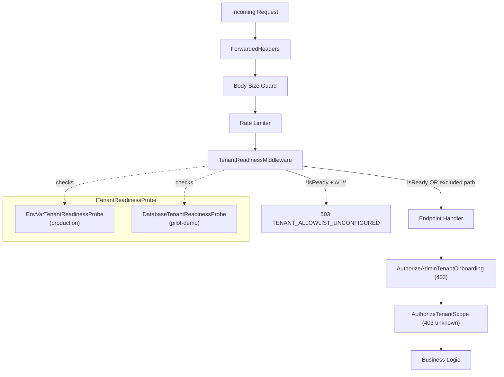

# TSK-P1-TEN-RDY: Tenant Readiness Middleware & Dynamic Initialization

## Problem Statement

Symphony's multi-tenancy architecture has two critical design flaws:

1. **Middleware Ordering Bug**: Admin authentication (403) executes *before* the tenant readiness check (503). When `SYMPHONY_KNOWN_TENANTS` is empty, requests are rejected with `FORBIDDEN_ADMIN_REQUIRED` instead of `TENANT_ALLOWLIST_UNCONFIGURED`. The evidence at [r_002_tenant_allowlist.json](file:///home/mwiza/workspaces/Symphony-Demo/Symphony/evidence/security_remediation/r_002_tenant_allowlist.json) confirms this: the test receives HTTP 403 instead of the expected 503.

2. **Hardcoded Pilot-Demo Bypass**: The pilot-demo profile previously hardcoded `tenantAllowlistConfigured = true` (now commented out at [Program.cs:L292](file:///home/mwiza/workspaces/Symphony-Demo/Symphony/services/ledger-api/dotnet/src/LedgerApi/Program.cs#L292)), which contradicts multi-tenancy best practices. Pilot-demo uses the `tenant_registry` DB table as its tenant source, but this is not unified with the env-var-based check used by production.

### Root Cause Analysis

The current request lifecycle is:
```
Request → Body Size → Rate Limit → [Handler: Admin Auth (403)] → [Handler: Tenant Scope (503)]
```

The correct lifecycle per industry standards should be:
```
Request → Body Size → Rate Limit → Tenant Readiness (503) → [Handler: Admin Auth (403)] → [Handler: Tenant Scope]
```

Every admin endpoint in [Program.cs](file:///home/mwiza/workspaces/Symphony-Demo/Symphony/services/ledger-api/dotnet/src/LedgerApi/Program.cs) calls `AuthorizeAdminTenantOnboarding()` first and `AuthorizeTenantScope()` second. There are **17+ endpoints** following this pattern, making per-handler reordering fragile and error-prone.

---

## User Review Required

> [!IMPORTANT]
> **Architectural Decision — Middleware vs In-Handler Fix**
> This plan proposes a **global middleware** approach rather than reordering checks inside each of the 17+ handlers. This is the recommended pattern because:
> - It enforces the 503-before-403 invariant for ALL current and future endpoints automatically
> - It eliminates the risk of a new endpoint forgetting the correct order
> - It aligns with the user's research on "System Readiness First" pipeline design

> [!WARNING]
> **Pilot-Demo Dynamic Resolution introduces a startup DB query**
> For pilot-demo, the readiness probe will query `tenant_registry` at startup (not per-request). The result is cached and only refreshed when tenants are onboarded. This avoids per-request DB overhead but means the system needs a signal when its first tenant is created.

> [!IMPORTANT]
> **Scope of Tenant Readiness Check**
> The middleware will ONLY apply to `/v1/*` API paths (and optionally `/pilot-demo/api/*` paths). Health probes (`/health`, `/healthz`, `/readyz`), static UI assets, and the tenant onboarding endpoint (`POST /v1/admin/tenants`) will be EXCLUDED — you must be able to onboard the first tenant even when no tenants exist yet.

---

## Proposed Changes

### Component 1: Tenant Readiness Probe (Abstraction Layer)

#### [NEW] [ITenantReadinessProbe.cs](file:///home/mwiza/workspaces/Symphony-Demo/Symphony/services/ledger-api/dotnet/src/LedgerApi/Security/ITenantReadinessProbe.cs)

A new interface that abstracts how tenant readiness is determined:

```csharp
interface ITenantReadinessProbe
{
    bool IsReady { get; }
    void MarkReady();
    Task RefreshAsync(CancellationToken ct);
}
```

Two implementations:
- **`EnvVarTenantReadinessProbe`** (production/staging): Checks `SYMPHONY_KNOWN_TENANTS` env var. `IsReady = !string.IsNullOrWhiteSpace(rawAllowlist)`.
- **`DatabaseTenantReadinessProbe`** (pilot-demo): Queries `tenant_registry` at startup. `IsReady = (count > 0)`. Exposes `MarkReady()` for the seed path to signal after first tenant creation.

---

### Component 2: Tenant Readiness Middleware

#### [NEW] [TenantReadinessMiddleware.cs](file:///home/mwiza/workspaces/Symphony-Demo/Symphony/services/ledger-api/dotnet/src/LedgerApi/Security/TenantReadinessMiddleware.cs)

A new ASP.NET middleware that runs *before* any endpoint handler:

```
Middleware Logic:
1. If path starts with /health, /healthz, /readyz → SKIP (passthrough)
2. If path is POST /v1/admin/tenants → SKIP (bootstrap endpoint)
3. If path starts with /pilot-demo/pilot/ (UI pages) → SKIP
4. If path starts with /pilot-demo/api/session/ → SKIP (session management)
5. If !readinessProbe.IsReady → return 503 with TENANT_ALLOWLIST_UNCONFIGURED
6. Otherwise → call next()
```

This ensures ALL tenant-scoped API endpoints get the 503 check before any handler-level auth.

---

### Component 3: Program.cs Wiring

#### [MODIFY] [Program.cs](file:///home/mwiza/workspaces/Symphony-Demo/Symphony/services/ledger-api/dotnet/src/LedgerApi/Program.cs)

**Changes:**

1. **Create the readiness probe at startup** (after line ~285):
   - For pilot-demo: instantiate `DatabaseTenantReadinessProbe`, call `RefreshAsync()` to check `tenant_registry`
   - For production: instantiate `EnvVarTenantReadinessProbe`
   - Replace the `tenantAllowlistConfigured` boolean with `readinessProbe.IsReady`

2. **Register the middleware** (after `app.UseRateLimiter()` on line 221):
   ```csharp
   app.UseMiddleware<TenantReadinessMiddleware>(readinessProbe);
   ```

3. **Update `/health` and `/healthz`** to use `readinessProbe.IsReady` instead of `tenantAllowlistConfigured`

4. **Update `SeedDemoTenant`** to call `readinessProbe.MarkReady()` after successful tenant creation, so the middleware unblocks subsequent requests

5. **Remove the commented-out hardcoded `tenantAllowlistConfigured = true`** (line 292) and the "TEMPORARILY DISABLED" comment block — replaced by the dynamic probe

---

### Component 4: ApiAuthorization Cleanup

#### [MODIFY] [ApiAuthorization.cs](file:///home/mwiza/workspaces/Symphony-Demo/Symphony/services/ledger-api/dotnet/src/LedgerApi/Security/ApiAuthorization.cs)

The `AuthorizeTenantScope()` method (line 104–130) currently re-reads `SYMPHONY_KNOWN_TENANTS` and returns 503 if empty. With the middleware handling the 503 check globally, this method can be simplified:
- **Keep** the `IsKnownTenant` check (403 for unknown tenants) — still needed per-request
- **Remove** the 503 `TENANT_ALLOWLIST_UNCONFIGURED` block — now handled by middleware
- For pilot-demo, `AuthorizeTenantScope` should delegate to the DB-backed tenant registry instead of the env var

---

### Component 5: Test Script Fix

#### [MODIFY] [test_tenant_allowlist_deny_all.sh](file:///home/mwiza/workspaces/Symphony-Demo/Symphony/scripts/audit/test_tenant_allowlist_deny_all.sh)

The test on line 71 currently sends `x-admin-api-key: $ADMIN_API_KEY` but the middleware fix means the 503 will be returned BEFORE the handler ever checks `x-admin-api-key`. Update the test to:
- Remove the `x-admin-api-key` header (no longer needed to reach tenant readiness logic)
- Verify that the 503 is returned WITHOUT any authentication headers
- Add a positive test: after setting `SYMPHONY_KNOWN_TENANTS`, verify the 503 goes away

---

### Component 6: Unit Tests

#### [NEW] [TenantReadinessMiddlewareTests.cs](file:///home/mwiza/workspaces/Symphony-Demo/Symphony/services/ledger-api/dotnet/src/LedgerApi/Security/TenantReadinessMiddlewareTests.cs)

Unit tests covering:
1. `IsReady=false` + `/v1/*` path → returns 503 with correct error body
2. `IsReady=false` + `/health` path → passthrough (200)
3. `IsReady=false` + `POST /v1/admin/tenants` → passthrough (bootstrap allowed)
4. `IsReady=true` + `/v1/*` path → passthrough to handler
5. `MarkReady()` transitions probe from not-ready to ready
6. `EnvVarTenantReadinessProbe` with empty env → not ready
7. `EnvVarTenantReadinessProbe` with populated env → ready

---

## Architecture Diagram



---

## Open Questions

> [!IMPORTANT]
> **Q1: Should `POST /v1/admin/tenants` be excluded from the readiness check?**
> If yes (recommended), the very first request to the system can be a tenant onboarding call. If no, you'd need to pre-seed via CLI or migration. The plan currently assumes YES — the tenant onboarding endpoint is the bootstrap escape hatch.

> [!IMPORTANT]
> **Q2: For pilot-demo, should the readiness probe be refreshed per-request or only at startup + on-write?**
> The plan assumes startup + on-write (calling `MarkReady()` from `SeedDemoTenant`). Per-request DB queries would add latency but ensure immediate consistency. Recommendation: startup + on-write is sufficient since tenants are created once and rarely.

---

## Verification Plan

### Automated Tests
1. **Unit tests**: Run `TenantReadinessMiddlewareTests.cs` — covers all middleware routing and probe behavior
2. **Integration test**: Run `scripts/audit/test_tenant_allowlist_deny_all.sh` — must PASS with both checks returning PASS
3. **Pre-CI gate**: Run `scripts/dev/pre_ci.sh` — full CI must pass

### Manual Verification
1. Start the app with `SYMPHONY_KNOWN_TENANTS` unset → verify `/health` reports `tenant_allowlist_configured: false`
2. Hit `/v1/evidence-packs/test-123` without any auth headers → verify 503 (not 403)
3. Hit `POST /v1/admin/tenants` with admin key → verify it's reachable (not blocked by middleware)
4. Start in pilot-demo with empty DB → verify 503 until `SeedDemoTenant` runs
5. After seed completes → verify normal operation resumes
